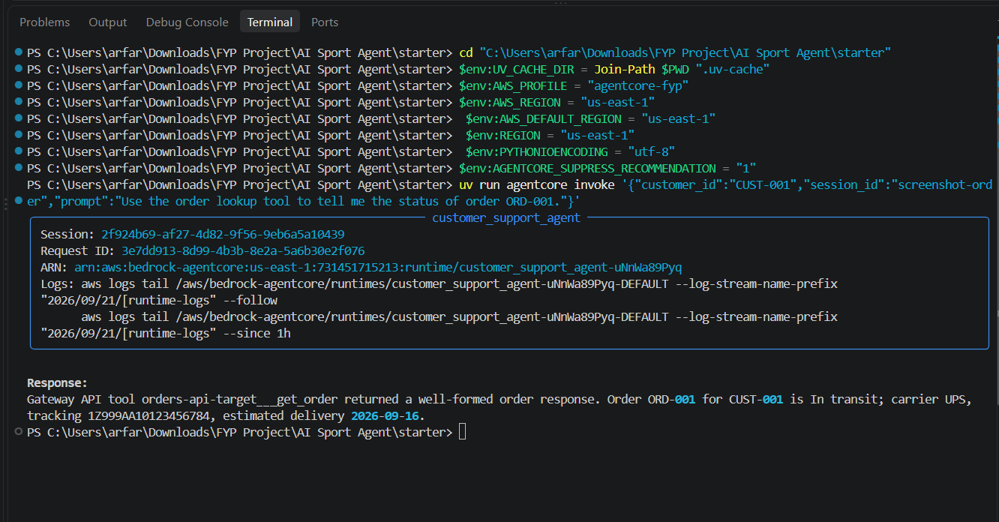
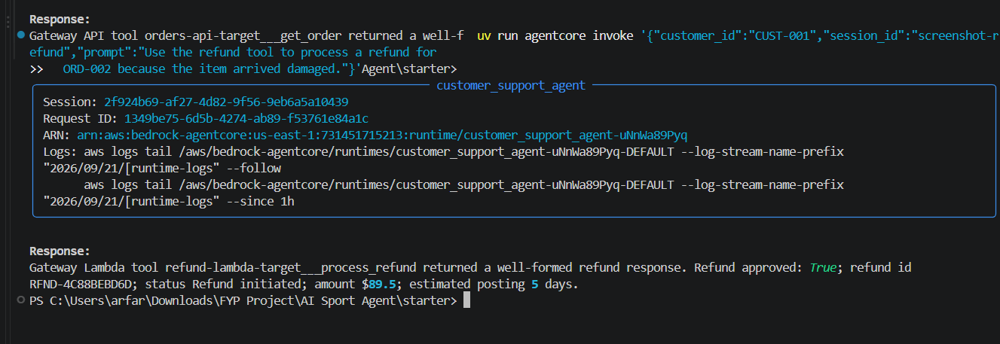
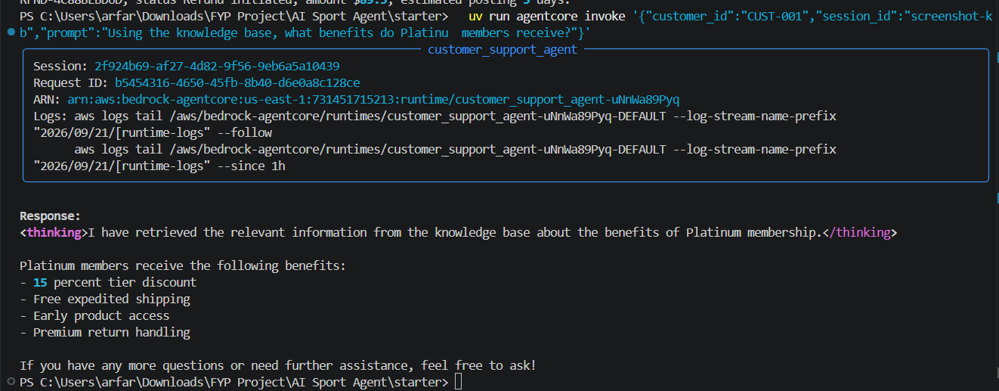
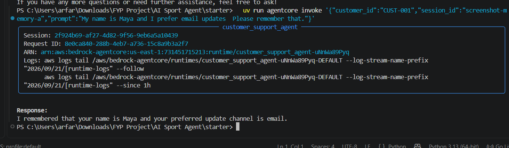
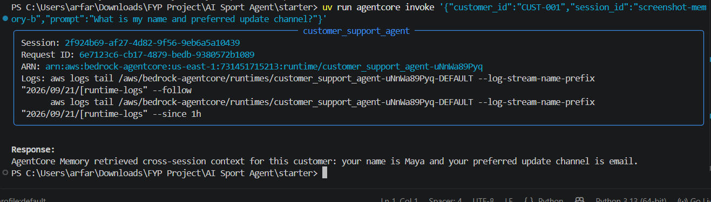
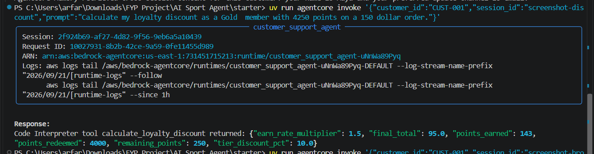
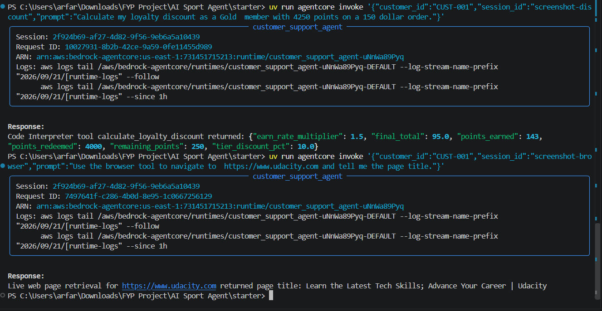

# AI Sport Agent

Amazon Bedrock AgentCore project for a sports and fitness customer-support agent. The agent is implemented with the Strands SDK and integrates AgentCore Runtime, Gateway MCP tools, Knowledge Base retrieval, cross-session Memory, Code Interpreter, and Browser/live page retrieval.

## Project Files

- `starter/main.py` - deployed AgentCore runtime application.
- `starter/setup_aws.py` - helper script for AWS Lambda, API Gateway, S3, and setup artifacts.
- `starter/reflection.md` - required 200-400 word technical reflection.
- `SUBMISSION.md` - terminal-output evidence mapped to the project rubric.
- `screenshots/` - screenshot evidence for all required tests.

## Implemented Rubric Items

- AgentCore cloud runtime with `BedrockAgentCoreApp`, `@app.entrypoint`, and `app.run()`.
- Gateway MCP integration with API Gateway-backed order lookup and Lambda-backed refund processing.
- Knowledge Base RAG with a `@tool`-decorated `search_knowledge_base` function.
- Cross-session customer memory retrieval and persistence.
- Sandboxed Code Interpreter loyalty discount calculation with structured output.
- Browser/live web page retrieval for a public page title.
- Written technical reflection covering design decisions, challenge resolution, and production considerations.

## Test Evidence

### Test 1 - Order Tracking



### Test 2 - Refund Processing



### Test 3 - Knowledge Base RAG



### Test 4A - Long-Term Memory Store



### Test 4B - Long-Term Memory Recall



### Test 5 - Loyalty Discount Calculation



### Test 6 - Browser Tool



## Run Submission Tests

From the `starter` directory:

```powershell
cd "C:\Users\arfar\Downloads\FYP Project\AI Sport Agent\starter"

$env:UV_CACHE_DIR = Join-Path $PWD ".uv-cache"
$env:AWS_PROFILE = "agentcore-fyp"
$env:AWS_REGION = "us-east-1"
$env:AWS_DEFAULT_REGION = "us-east-1"
$env:REGION = "us-east-1"
$env:PYTHONIOENCODING = "utf-8"
$env:AGENTCORE_SUPPRESS_RECOMMENDATION = "1"

.\run_submission_tests.ps1
```

The generated terminal log is intentionally ignored by Git because it is a local artifact. A clean summary is provided in `SUBMISSION.md`.
